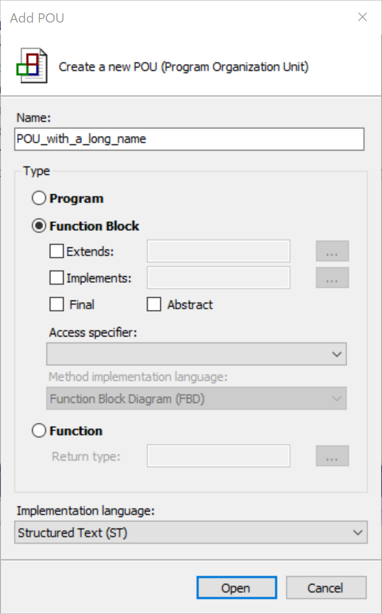
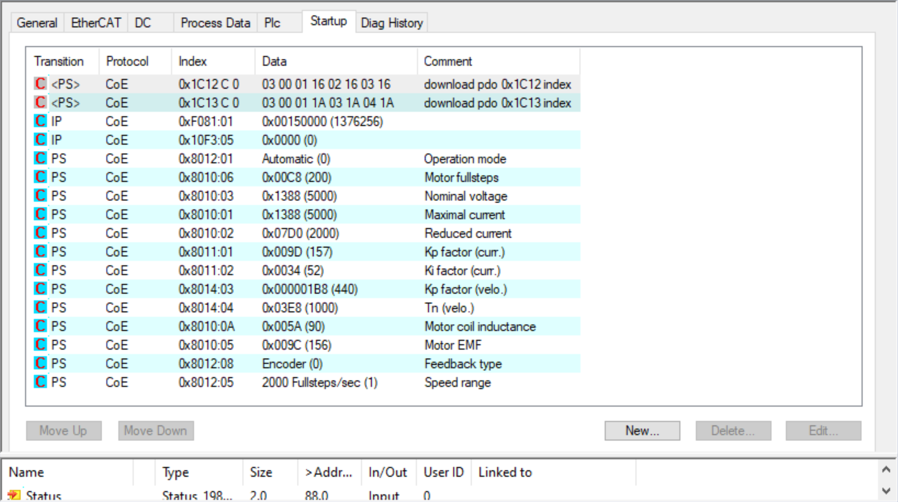

# twincat-high-dpi-fix
Fixes for TwinCAT display issues

## Summary

Before 3.1.4026.x the TwinCAT XAE and related tools such as route manager do not display correctly on 4K monitors. Unfortunately many monitors since 2018 are 4K. Thankfully there is a simple fix.

## Identifying the problem

After installing XAE Shell or TwinCAT 3 integrated into Visual Studio, you may see that many tables are compressed and various dialogs and other artifacts are rendered incorrectly.

Before fix (with DPI awareness enabled) | After fix (with DPI awareness disabled) |
|----------|-----------|
|
|
|
|

After digging into this a bit, I finally determined that this is due to TwinCAT using CoDeSys underneath, and CoDeSys using old WinForms dialogs for everything.


Searching for "Windows forms high DPI display issue in visual studio" reveals a number of articles. Including this link from Microsoft [Disable DPI-awareness to fix HDPI / scaling issues with Windows Forms Designer in Visual Studio](https://docs.microsoft.com/en-us/visualstudio/designers/disable-dpi-awareness?view=vs-2019) and [Using the WinForms designer on high‑DPI systems](https://www.mking.net/blog/using-the-winforms-designer-on-high-dpi-systems). I found the second solution most helpful and repeat the instructions below.

## Fixing TwinCAT XAE Shell

If you are using TwinCAT XAE Shell, run the [disable-dpi-awareness-TcXaeShell.reg](disable-dpi-awareness-TcXaeShell.reg) script (repeated below), or manually edit this key in the Windows registry.

```
Windows Registry Editor Version 5.00

[HKEY_LOCAL_MACHINE\SOFTWARE\Microsoft\Windows NT\CurrentVersion\Image File Execution Options\TcXaeShell.exe]
"dpiAwareness"=dword:00000000
```

To revert, run the [enable-dpi-awareness-TcXaeShell.reg](enable-dpi-awareness-TcXaeShell.reg) script (repeated below), or manually edit this key in the Windows registry.

```
Windows Registry Editor Version 5.00

[HKEY_LOCAL_MACHINE\SOFTWARE\Microsoft\Windows NT\CurrentVersion\Image File Execution Options\TcXaeShell.exe]
"dpiAwareness"=dword:00000001
```

## Fixing TwinCAT XAE Integrated into Visual Studio (2017, 2019, etc)

If you are using TwinCAT XAE integrated into Visual Studio, run the [disable-dpi-awareness-devenv.reg](disable-dpi-awareness-devenv.reg) script (repeated below), or manually edit this key in the Windows registry.

```
Windows Registry Editor Version 5.00

[HKEY_LOCAL_MACHINE\SOFTWARE\Microsoft\Windows NT\CurrentVersion\Image File Execution Options\devenv.exe]
"dpiAwareness"=dword:00000000
```

To revert, run the [enable-dpi-awareness-devenv.reg](enable-dpi-awareness-devenv.reg) script (repeated below), or manually edit this key in the Windows registry.

```
Windows Registry Editor Version 5.00

[HKEY_LOCAL_MACHINE\SOFTWARE\Microsoft\Windows NT\CurrentVersion\Image File Execution Options\devenv.exe]
"dpiAwareness"=dword:00000001
```

## Fixing Route Manager

Similarly, to fix the Route Manager dialog, run the [disable-dpi-awareness-TcAmsRemoteMgr.reg](disable-dpi-awareness-TcAmsRemoteMgr.reg) script (repeated below), or manually edit this key in the Windows registry.

```
Windows Registry Editor Version 5.00

[HKEY_LOCAL_MACHINE\SOFTWARE\Microsoft\Windows NT\CurrentVersion\Image File Execution Options\TcAmsRemoteMgr.exe]
"dpiAwareness"=dword:00000000
```

To revert, run the [enable-dpi-awareness-TcAmsRemoteMgr.reg](enable-dpi-awareness-TcAmsRemoteMgr.reg) script (repeated below), or manually edit this key in the Windows registry:

```
Windows Registry Editor Version 5.00

[HKEY_LOCAL_MACHINE\SOFTWARE\Microsoft\Windows NT\CurrentVersion\Image File Execution Options\TcAmsRemoteMgr.exe]
"dpiAwareness"=dword:00000001
```

